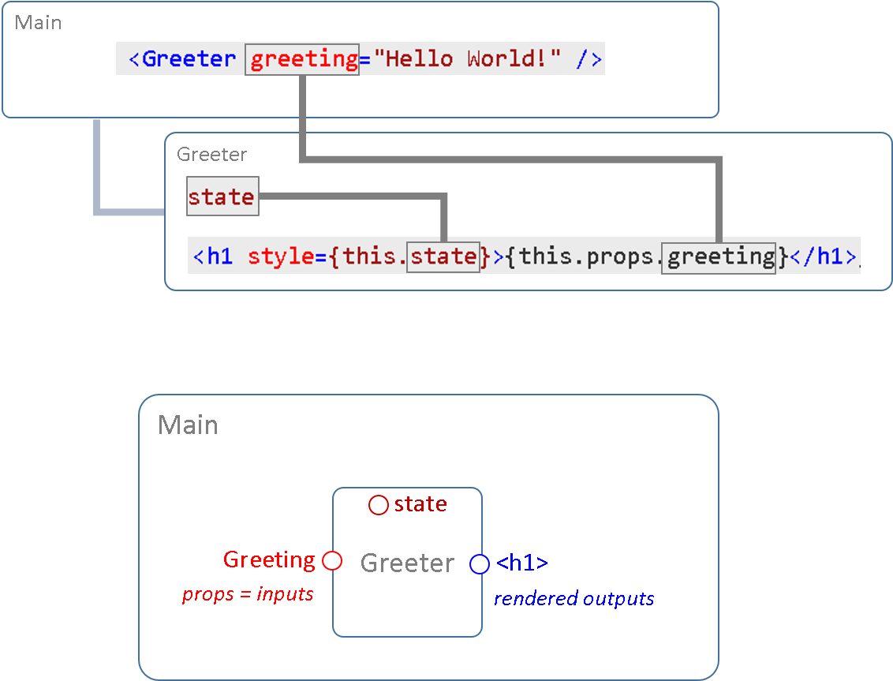

# WebFrameworks Deel I (26543/1700/1920/1/00)

## React Basics

### What is React


React is a Javascript framework to build mobile and single-page user interfaces with. It is unique in that it offers a modular approach to building your views. Go to the [original web site](https://reactjs.org/) and find getting started tutorial [here](https://reactjs.org/docs/getting-started.html) and [here](https://www.taniarascia.com/getting-started-with-react/).

### A bit of History

The diagram below depicts some of the main events in the recent history of React:


React itself was created under the name React.js in 2011 by Jordan Walke, a Facebook employee. In 2013 it was turned into a open source project. React Native has been added two years later to allow for native development, i.e. specific for a given type of (mobile) devices. Later, React Fiber was introduced as a lab to demonstrate and try out new features.

Note that the birth of React was dependent on a bunch of other technologies, two of which we will discuss later in more detail: `JSX` and `ES6`. The former is a way to write xml-tags inside JavaScript code blocks, the latter is the next-generation JavaScript language.

In the meanwhile, Google Trends of the term "React" still shows a growing number of users:


### Hello World

Let us now dive into the language and look at a simple Hello World implementation in React:

```html
<!DOCTYPE html>
<html>
  <head>
    <meta charset="UTF-8" />
    <title>Hello World</title>
    <script src="./babel.min.js"></script>
    <script src="./react.development.js"></script>
    <script src="./react-dom.development.js"></script>
  </head>
  <body>
    <div id="root"></div>

    <script type="text/babel">
      class Greeter extends React.Component {
        state = { color: "red" };
        render() {
          return <h1 style={this.state}>
            {this.props.greeting}
          </h1>;
        }
      }

      ReactDOM.render(
        <Greeter greeting="Hello World!" />,
        document.getElementById("root")
      );
    </script>
  </body>
</html>
```

Take this code snippet and paste it somewhere as HTML file. Then, open it with your browser and you should see something like this:


Below, we will go through each line of code. After that, you should be able to grasp the most important principles of the React framework.

### In-page React

We will later see that there are better ways to do this, but notice that we were able to create the Hello World web application **inside a HTML** page.

> A complete React single-page application can be run from within a HTML web page.

On the top of the page you see that there are three scripts that are needed to run a React app:

```html
<!DOCTYPE html>
<html>
  <head>
    <script src="./babel.min.js"></script>
    <script src="./react.development.js"></script>
    <script src="./react-dom.development.js"></script>
  </head>
  <body>
    <!--  -->
  </body>
</html>
```

Here, the three script includes have been placed as files in the same directory as the HTML page itself (hence the `./`).

### The Root Element

Within the `body` tag, we see 2 children:

```html
<div id="root"></div>

<script type="text/babel">
  // Here comes the React logic
</script>

<!-- more html here which is not being controlled by React,
such as a static footer, for example -->
```

The first is a `div` element which we call the root. All of the content that will be controlled by React, will be placed dynamically inside this root element.

> Note the although XML specifications say that empty elements can be made self-closing, React or other frameworks sometimes have trouble dealing with elements such as `<div id="root" />`, so carefull with those.

The comment indicates that there can be other content outside the root element which is not controlled by React, i.e. which is static and not dependent on any business logic.

### JSX and Babel

Notice that in the in-page version of our Hello World application, all the React logic is written within `script` tags. However, there is something special about these script tag, namely the `type="text/babel"` attribute. This announces to the browser that what follows is being interpreted by a tool called Babel, which we imported as the first script include. This tool allows to use very appealing syntactic sugar like this:

```jsx
const Translated_Title = Translate ( Title, Language );
return <div> <!-- Always single root container -->
	<span className="language">{Language}</span> <!-- In React attributes get other labels. e.g. `class` -> `className` because of the obvious naming conflicts-->
	<span>{Translated_Title}</span>;
</div>;
```

In case you haven't noticed, it is pretty bizar to have HTML tags inside a block JavaScript code. We will look at this in greater detail later. For now, it is sufficient to know that `<span>{Translated_Title}</span>` will be turned into something like `<span>De titel</span>` by the time it is being displayed by the browser. So content is dynamically being generated by React.

> Just as many other frameworks, one of the key points of React is the ability to generate HTML programatically.

Plain JavaScript also allows for the generation of HTML content dynamically, but the JSX way is simply more pleasant, especially when things get a little bit more complex.

So here I reitereate the point that Babel is not strictly necessary for React at all, it is only syntactic sugar. To demonstrate this point I show **three different syntaxes for the exact same element** (so completely interchangeable!):

```jsx
MyEl = <div className=“greeting”>{props.name}</div>
```

```js
MyEl = React.createElement('div', {className: 'greeting'}, props.name);
```

```json
MyEl = {
  type: 'div',
  props: {
    className: 'greeting',
    children: props.name
  }
}
```

Notes:

- You can find the specs of all possible media types for scripts [here](http://www.iana.org/assignments/media-types/media-types.xhtml)
- Always have one root container.
- JSX was invented to avoid JQuery-way of building strings: `"<p class='" + My_Class + "'" + …`
- *Attributes* become *properties* and get re-formatted into lower camel case (`onclick` -> `onClick`) or get slightly different names such as for `class -> className`

### Our First Component

Inside the `script` tag, we first encounter this piece of code:

```jsx
class Greeter extends React.Component {
  state = { color: "red" };
  render (){
    return <h1 color={this.state.color}>{this.props.greeting}</h1>;
  }
}
```

What happens here is the declaration of a `class` named `Greeter`. That might sound a little bit strange depending on your background knowledge of JavaScript, but remember that we are dealing here with ES6 (ECMAScript 6) which resembles JavaScript and is backwards compatible with JavaScript but which also allows to do much more! Indeed, ES6 at making JavaScript more Object-Oriented and Type-save.

In this case, the class is called `Greeter` and it inherits from the `Component` superclass of the `React` namespace, which is our second script include.

> A Component is a reusable UI element. It could be as small as a `span` tag with some particular attributes or could consist of a complete web application and anything in-between.

In our case, it is very simple indeed, as it is composed of a single `h1` tag. Notice how the generated content is being returned from the method `render` which is method inherited from from the `Component` class. Remember, as this is being inherited, you cannot rename the `render` *method property* to anything else!

> Read [this](https://medium.com/ecmascript-2015/es6-classes-and-inheritance-607804080906) to understand the basics of inheritance syntax in ES6.

<details><summary>Here is another example demonstrating inheritance</summary>

```js
class Animal {
  constructor(name) {
    this.name = name;
  }
  speak() {
    console.log(this.name + " makes a noise.");
  }
}

class Dog extends Animal {
  constructor(name) {
    super(name);
  }
  speak() {
    console.log(this.name + " barks.");
  }
}

let d = new Dog("Mitzie");
d.speak(); // Mitzie barks.
```

</details><br />

Because we are in JSX mode, we were able to write:

```jsx
return <h1 color={this.state.color}>{this.props.greeting}</h1>;
```

As mentioned, we return an `h1` element. On it, there are two 'parameters': one to determine the `color` attribute and one that sets the content of the heading tag. In JSX, such 'parameters' are delimited by curly braces and must contain an ES6 expression that returns a string. The value `this.state.color` indeeds returns a string, namely `"red"`. Why not simply say `color="red"` then? Because state is a special property that is also inherited from the `Component` class and that conveys a special function, namely that of a local observable state or context. In plain English, it means that the `state` variable serves as a memory for `Greeter` that is being 'watched' by React. The React framework will know when is value is being changed and will also know that upon a change, it needs to re-render the `h1` element.

### Component Hierarchies

The second parameter is `this.props.greeting` and for us to understand this we, need to reveal the last piece of missing code:

```jsx
class Greeter extends React.Component {
  state = { color: "red" };
  render() {
    return <h1 style={this.state}>{this.props.greeting}</h1>;
  }
}

ReactDOM.render(
  <Greeter greeting="Hello World!" />,
  document.getElementById("root")
);
```

The `ReactDOM.render` is our third and final script include. It forms the top react component which will call the `Greeter` component as its child. So here the hierarchy is pretty simple and consists of:

```txt
DOM
 └——— Greeter
         └——— h1
```

Mind that a hierarchy can be a mix of React Component and HTML elements. `Greeter` is a Component and `h1` of course is an HTML element. The lowest level of the hierarchy must always be pure HTML. The syntax for a React Component tag is similar to that of a true HTML tag:

```jsx
return <div>
	{/* Components must be in PascalCase */}
	<ComponentTwo attr="no content" />
	<ComponentOne attr="Some value">Some content here</ComponentOne>
</div>;
```

The DOM here also stands for Document Object Model but represents a virtual representation of the true DOM: the **Virtual DOM**. So what React is doing, is creating a 'mental' map of all the HTML content that is dynamically being rendered and fitted within the root element. So the `ReactDOM.render` has two arguments. The first, `<Greeter greeting="Hello World!" />`, is the child component of the virtual DOM and the second, `document.getElementById("root")`, is the 'physical' root element on the page where the content is to be injected.

### Props

Note that an attribute is being passed on from the main component to its only child: `greeting="Hello World!"`. Such an attribute is called a **prop** (short for property, could be quite confusion&hellip;). This prop is indeed the one being consumed by the child (`this.props.greeting`). Notice that all props being received from a parent are being placed in the `this.props` class property by the React framework. Let us visualize this:



The diagram depicts the `greeting` prop as an input of the `Greeter` component, just as an attribute on a HTML element can be seen as an input or parametrization for drawing that HTML element.
